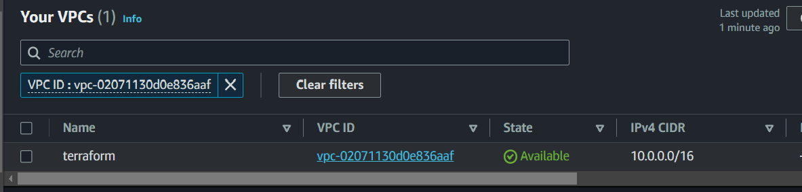
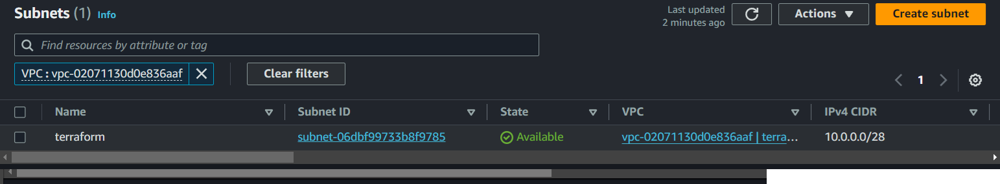
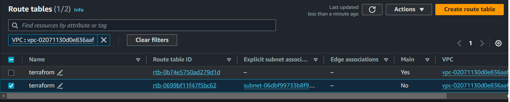
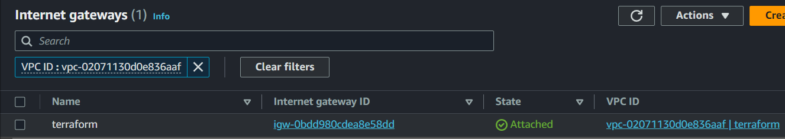
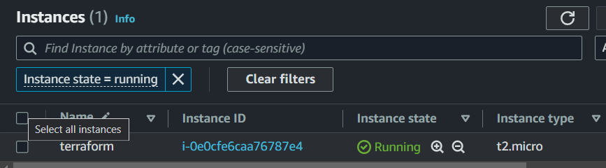

# In this file we create an EC2 instance using Terraform

---

1. we write the provider.tf file to enable Terraform to interact with the aws cloud provider.
2. In the resourece.tf file we write the resources such as **vpc,subnet,internetgateway,route-table,securitygroup**.
3. In the ec2.tf file consists of resouce **aws instance** data resource **aws ami** the aws ami  data-resource is used fetch the data of the instance ami-id, which we use to create the instance.

---

## outputs

1. The resources are created once we run the command **terraform apply -auto-approve**.
2. The vpc resource created 
3. The subnet resource created 
4. The route-table created 
5. The internet-gateway created 
6.The instance created 